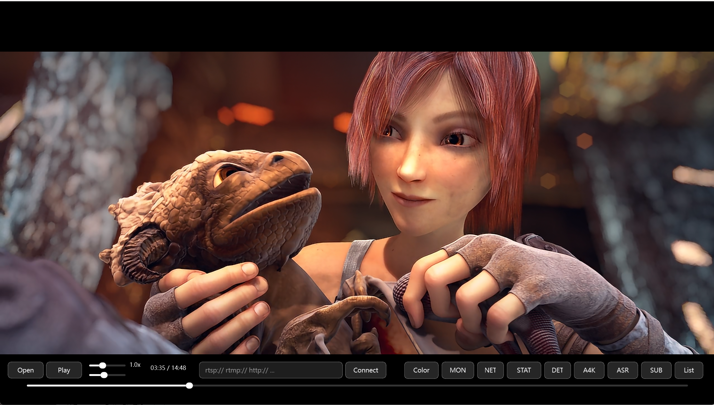
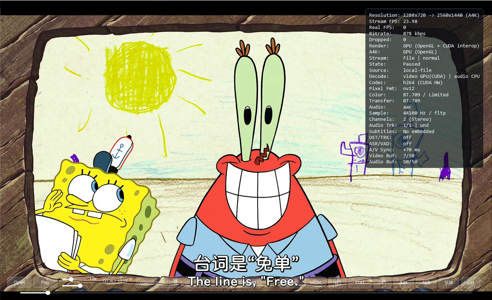
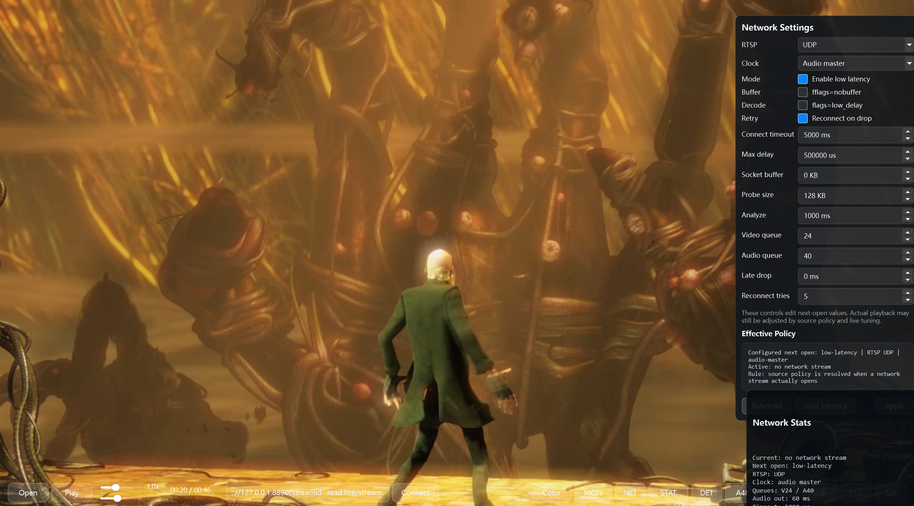
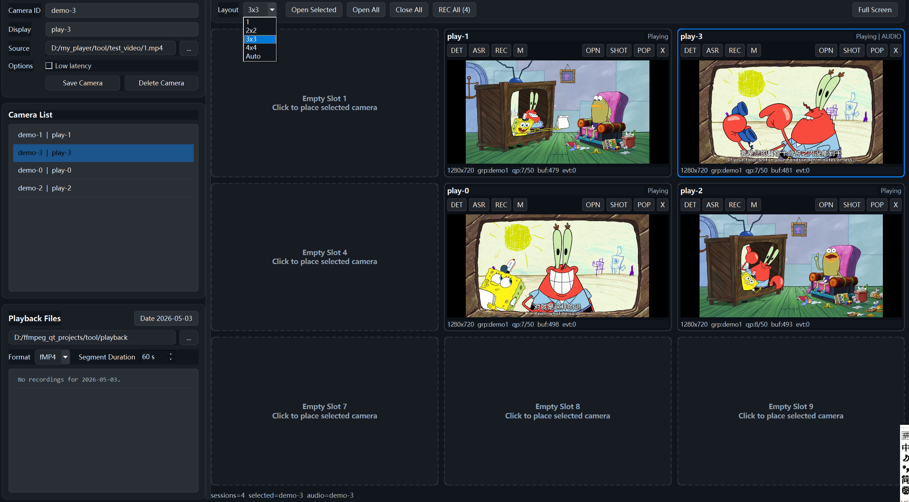
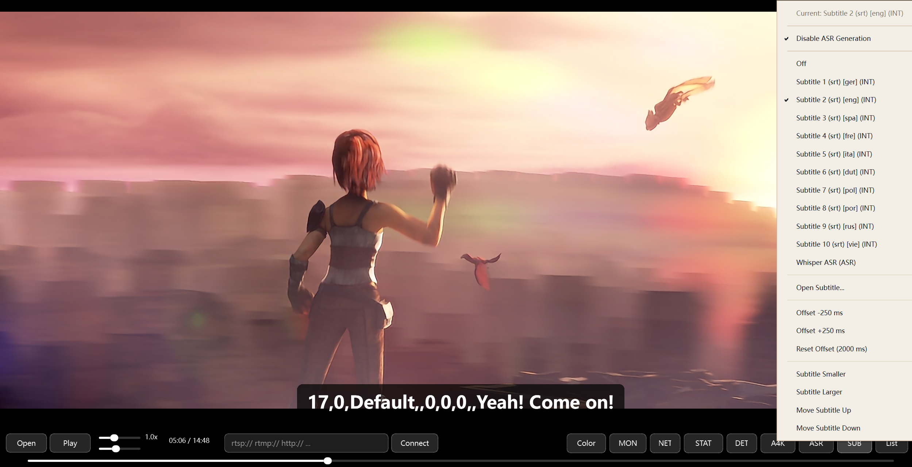

# MyPlayer

<p align="center">
  
</p>

MyPlayer is a Windows-first C++ media player built with Qt 6, FFmpeg, CUDA and ONNX Runtime. It focuses on three workflows:

1. Local media playback with FFmpeg-based demuxing, decoding, seeking and subtitle support.
2. Low-latency live stream playback for RTSP, RTMP, HLS and HTTP-FLV.
3. AI-assisted monitoring with object detection, tracking, ASR/VAD, recording and archive workflows.

The public checkout is intended for source review, learning, research and engineering experimentation. Linux and WSL experiments are not part of this public source tree.

## Features

- Local playback for common media files, with playback restore, seeking, audio/video sync and multi-track audio.
- Live stream playback for RTSP, RTMP, HTTP-FLV and HLS, with reconnect, buffering and low-latency tuning policies.
- GPU-oriented video path with CUDA decode, CUDA/NPP preprocessing, OpenGL rendering and Anime4K-style enhancement stages.
- AI pipeline for RT-DETR detection, ByteTrack tracking, Whisper ASR and VAD segmentation.
- Monitoring workflow with multi-stream sessions, detection overlays, recording, archive indexing and status panels.
- Qt desktop UI with playback controls, network controls, feature toggles and diagnostic panels.

## Screenshots

<table>
  <tr>
    <td align="center">
      
      <br>
      <sub>Local playback</sub>
    </td>
    <td align="center">
      
      <br>
      <sub>Live stream playback</sub>
    </td>
  </tr>
  <tr>
    <td align="center">
      
      <br>
      <sub>Monitoring with detection</sub>
    </td>
    <td align="center">
      
      <br>
      <sub>ASR and subtitles</sub>
    </td>
  </tr>
</table>

## Tested Environment

The project is currently maintained as a Windows desktop application.

| Component | Tested or expected version |
| --- | --- |
| OS | Windows 11 |
| Compiler | Visual Studio 2022, MSVC x64 |
| CMake | 3.26 or newer |
| Qt | Qt 6.8.x for MSVC 2022 x64 |
| CUDA Toolkit | CUDA 12.x |
| FFmpeg | FFmpeg development and runtime libraries |
| ONNX Runtime | ONNX Runtime GPU package |
| OpenCV | OpenCV C++ libraries |
| whisper | whisper.cpp-compatible library |
| libass | Resolved from the local vcpkg dependency bundle |

Exact binary package versions are not vendored in this repository. If you redistribute binaries, verify the licenses and build options of each dependency.

## Source Layout

```text
my_player/
  CMakeLists.txt
  CMakePresets.json
  README.md
  LICENSE
  THIRD_PARTY_NOTICES.md
  cmake/
    MyPlayerQt.cmake
    MyPlayerDependencies.cmake
    MyPlayerSources.cmake
    MyPlayerDeploy.cmake
  src/
    MyPlayer/
      app/
      common/
      core/
      features/
      ui/
      CMakeLists.txt
    ByteTrack/
      include/bytetrack/
      CMakeLists.txt
```

The root `CMakeLists.txt` enters the application project under `src/MyPlayer`. The `cmake/` directory contains reusable CMake modules for Qt discovery, dependency discovery, source collection and runtime plugin deployment. `src/ByteTrack` is built as a local source dependency for the detector pipeline.

## Dependencies

Large SDKs, runtime binaries, model files and test media are intentionally not included. Prepare dependency directories at the repository root before configuring CMake:

```text
include/
lib/
bin/
vcpkg_installed/
```

Expected layout:

```text
include/
  cuda12/
  ffmpeg/
  onnxruntime/
  whisper/
  Eigen/
  opencv2/

lib/
  common/
    ffmpeg/
    onnxruntime/
    whisper/
  Debug/
    opencv/
    bytetrack/
  Release/
    opencv/
    bytetrack/

bin/
  common/
    labels/
    models/
  Debug/
  Release/

vcpkg_installed/
  x64-windows/
```

`src/ByteTrack` is built from source when present. Generated ByteTrack libraries are written to `lib/Debug/bytetrack` and `lib/Release/bytetrack` during the build.

Runtime DLLs and Qt plugins are expected under the selected configuration directory, for example `bin/Release`.

## Environment Variables

Set these variables before configuring:

```powershell
$env:MYPLAYER_QT_ROOT = "<Qt 6 MSVC x64 root>"
$env:Qt6_DIR = "$env:MYPLAYER_QT_ROOT\lib\cmake\Qt6"
$env:CUDA_PATH = "<CUDA Toolkit root>"
$env:MYPLAYER_CMAKE_TOOLCHAIN_FILE = "<vcpkg root>\scripts\buildsystems\vcpkg.cmake"
```

Example values:

```powershell
$env:MYPLAYER_QT_ROOT = "D:\Qt\6.8.2\msvc2022_64"
$env:Qt6_DIR = "$env:MYPLAYER_QT_ROOT\lib\cmake\Qt6"
$env:CUDA_PATH = "C:\Program Files\NVIDIA GPU Computing Toolkit\CUDA\v12.8"
$env:MYPLAYER_CMAKE_TOOLCHAIN_FILE = "D:\vcpkg\scripts\buildsystems\vcpkg.cmake"
```

The preset passes `MYPLAYER_EXTERNAL_ROOT` to CMake, so dependency folders are resolved relative to the repository root.

## Build

Configure from the repository root:

```powershell
cd <repo-root>
cmake --preset vs2022-x64
```

Build Release:

```powershell
cmake --build _cmake_build --config Release --target MyPlayer -- /m
```

Build Debug:

```powershell
cmake --build _cmake_build --config Debug --target MyPlayer -- /m
```

Output:

```text
bin/Release/MyPlayer.exe
bin/Debug/MyPlayer.exe
```

## Run

Run the executable from the generated runtime directory:

```powershell
.\bin\Release\MyPlayer.exe
```

The runtime directory must contain the required Qt plugins, FFmpeg DLLs, ONNX Runtime DLLs, CUDA-related runtime DLLs, model files and label files. The CMake deploy step copies selected Qt plugins when `MYPLAYER_QT_ROOT` is configured.

## Model Files

AI features are optional at runtime, but they require model and label files when enabled.

Expected location:

```text
bin/common/models/
bin/common/labels/
```

Typical files:

| File | Purpose | Required for |
| --- | --- | --- |
| `rtdetr-l.onnx` | Object detection | Detector |
| `coco80.txt` | Detection labels | Detector |
| Whisper model file | Speech recognition | ASR |
| VAD model file | Voice activity detection | VAD |

Model files are not included. Check the original model and dataset licenses before use or redistribution.

## Usage

### Open local media

1. Launch `MyPlayer.exe`.
2. Click `Open`.
3. Select a supported media file.

### Play a live stream

1. Enter an RTSP, RTMP, HLS or HTTP-FLV URL in the network input field.
2. Click `Connect`.
3. Adjust network settings if you need balanced or low-latency playback.

### Enable AI detection

1. Place the detection model and label file under `bin/common/models` and `bin/common/labels`.
2. Launch the player.
3. Enable detection from the feature controls.

## Troubleshooting

### CMake cannot find Qt6

Check that `MYPLAYER_QT_ROOT` points to the MSVC x64 Qt installation and `Qt6_DIR` points to `lib/cmake/Qt6`.

### CUDA toolset cannot be found

Check that `CUDA_PATH` points to a CUDA Toolkit installation supported by Visual Studio.

### ONNX Runtime or FFmpeg DLLs are missing

Copy the required runtime DLLs to `bin/Release` or `bin/Debug`, depending on the configuration you run.

### Detector model or labels are missing

Place detector model files under `bin/common/models` and label files under `bin/common/labels`.

## Known Limitations

- Windows-first source tree. Linux, macOS and WSL builds are not supported by this public checkout.
- Large SDKs, runtime DLLs, model files and test videos are not included.
- AI features require compatible model files. GPU acceleration requires an NVIDIA GPU and CUDA runtime.
- Commercial redistribution requires checking third-party licenses, especially Qt, FFmpeg builds, ONNX Runtime, CUDA runtime files and model files.

## License

MyPlayer source code is released under the MIT License. See `LICENSE`.

The project license does not override third-party licenses. See `THIRD_PARTY_NOTICES.md` for dependency notices.
